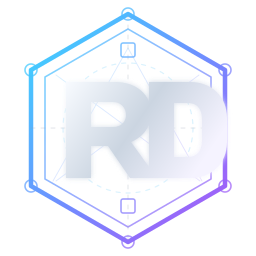

**Português** | [English](README.en.md)

  

# Rodrigo de Oliveira

**Arquiteto de Software | Sistemas Distribuídos | .NET | Cloud | DDD | Governança como Código**

Sou arquiteto de software com mais de 20 anos de experiência construindo, modernizando e evoluindo sistemas corporativos.

Atuo na interseção entre **negócio, arquitetura e engenharia**, transformando necessidades, atributos de qualidade e restrições operacionais em decisões técnicas que os times conseguem implementar, observar, operar e evoluir.

Meu foco é transformar **decisões arquiteturais em código, contratos, guardrails e automação**, mantendo a arquitetura próxima o suficiente da engenharia para que suas premissas possam ser validadas na prática.

**[Portfólio profissional](https://rodri-oliveira-dev.github.io/)** · [LinkedIn](https://www.linkedin.com/in/rodri-oliveira-dev) · [Café com código](https://www.linkedin.com/newsletters/caf%C3%A9-com-c%C3%B3digo-6880618748047314945) · [NuGet](https://www.nuget.org/profiles/rodri-oliveira-dev)

---

## Arquitetura na prática

Meus projetos open source tornam parte do meu raciocínio de engenharia inspecionável. O ponto central não é a tecnologia isolada, mas **o problema, as restrições, a decisão tomada e a forma como essa decisão pode ser validada no código, na infraestrutura e na automação**.

| Projeto | Problema, decisão e evidência |
| --- | --- |
| **[POC Arquitetura](https://github.com/rodri-oliveira-dev/poc-arquitetura)** | Como manter consistência e rastreabilidade entre serviços distribuídos: DDD, bounded contexts, Kafka, Outbox/Inbox, idempotência, sagas, OpenTelemetry, ADRs e runbooks tornam os trade-offs e modos de falha explícitos. |
| **[ReliableWebhooks](https://github.com/rodri-oliveira-dev/ReliableWebhooks)** | Como entregar webhooks de forma confiável em ambientes sujeitos a falhas: at-least-once delivery, leases, concorrência limitada, retries determinísticos, HMAC-SHA256, observabilidade e políticas de destino tornam confiabilidade e segurança responsabilidades explícitas. |
| **[Terraform GCP .NET Blueprint](https://github.com/rodri-oliveira-dev/terraform-gcp-dotnet-blueprint)** | Como transformar decisões de infraestrutura em uma baseline reproduzível: Terraform, Cloud Run, Cloud Run Jobs, Pub/Sub, DLQ, Redis, Secret Manager, VPC, IAM, Workload Identity Federation, CI e observabilidade compõem uma referência orientada a produção para workloads .NET no Google Cloud. |
| **[ADR Guard](https://github.com/rodri-oliveira-dev/adr-guard)** | Como tornar decisões arquiteturais verificáveis e automatizáveis: validação e indexação determinística de ADRs, regras estáveis para CI/CD e drafting assistido por IA mantendo contexto, revisão e aceitação arquitetural sob controle humano. |
| **[DotNetRepoInspector](https://github.com/rodri-oliveira-dev/DotNetRepoInspector)** | Como aplicar governança sobre repositórios .NET sem heurísticas frágeis: metadados avaliados pelo MSBuild são tratados como fonte de verdade e expostos por contratos determinísticos para CI/CD e automação. |
| **[.NET Library Template](https://github.com/rodri-oliveira-dev/dotnet-library-template)** | Como transformar práticas recorrentes de build, testes, segurança, empacotamento, versionamento e release em um golden path reutilizável, incluindo package validation, NuGet Audit, CodeQL, Trusted Publishing via OIDC e controles de software supply chain. |
| **[ComplexityAnalysis.Analyzers](https://github.com/rodri-oliveira-dev/complexity-analyzers)** | Como transformar complexidade de código em feedback automatizado durante o desenvolvimento: análise Roslyn para complexidade algorítmica, ciclomática, cognitiva e estrutural, com comportamento conservador quando a inferência não é segura. |

[Ver todos os repositórios →](https://github.com/rodri-oliveira-dev?tab=repositories)

---

## Governança como código

Arquitetura sustentável também depende de tornar padrões operacionais e de engenharia executáveis.

O repositório **[.github](https://github.com/rodri-oliveira-dev/.github)** funciona como um pequeno **control plane de engenharia** para os projetos que mantenho: centraliza padrões de contribuição e segurança, automatiza manutenção cross-repository, inventaria projetos .NET a partir de metadados avaliados pelo MSBuild, oferece secret scanning reutilizável e governa a sincronização e distribuição de instruções e skills para agentes de desenvolvimento.

As automações seguem princípios de **least privilege, mudanças review-gated, defaults seguros e autoridade local do repositório**. Escritas são conduzidas por Pull Requests revisáveis, enquanto fluxos somente leitura permanecem isolados de permissões de mutação.

Isso reflete uma das ideias que orientam meu trabalho: **preferir guardrails automatizados a processos burocráticos sempre que a regra puder gerar feedback útil para os times**.

---

## Manutenção open source

Também atuo como mantenedor de projetos que já possuem histórico, usuários e contratos públicos estabelecidos.

**[Dapper.FluentMap](https://github.com/rodri-oliveira-dev/Dapper-FluentMap)** — mantenedor atual da biblioteca de mapeamento fluente para Dapper, criada originalmente por **Henk Mollema**. Estou conduzindo sua retomada e modernização, preservando compatibilidade com o ecossistema existente enquanto evoluo runtime, tooling, CI/CD, qualidade, segurança e estratégia de distribuição para a próxima geração do projeto.

Assumir um projeto existente envolve um tipo diferente de engenharia: **evoluir sem desconsiderar o contrato construído ao longo dos anos com seus usuários**.

---

## Contribuições open source

Contribuir em bases de código que não controlo é outra forma de tornar minha engenharia verificável: entender decisões existentes, respeitar contratos e convenções do projeto, discutir trade-offs e entregar mudanças compatíveis com o ecossistema.

| Projeto | Contribuição |
| --- | --- |
| **[Ocelot](https://github.com/ThreeMammals/Ocelot)** | [PR #2420](https://github.com/ThreeMammals/Ocelot/pull/2420): tratamento de timeout downstream como **504 Gateway Timeout**, alinhado à RFC 9110. [PR #2421](https://github.com/ThreeMammals/Ocelot/pull/2421): cobertura de regressão para roteamento de `multipart/form-data`, preservando body, boundary e metadados do arquivo. |
| **[CrispyWaffle](https://github.com/guibranco/CrispyWaffle)** | [PR #980](https://github.com/guibranco/CrispyWaffle/pull/980): suporte a serialização YAML com YamlDotNet, integração com as abstrações existentes, testes e documentação. |
| **[Architecture Decision Record](https://github.com/architecture-decision-record/architecture-decision-record)** | [PR #115](https://github.com/architecture-decision-record/architecture-decision-record/pull/115): localização completa para Português do Brasil, preservando estrutura, referências e identidade entre os conteúdos equivalentes. |

**[Acompanhar contribuições e trabalho em andamento →](https://github.com/users/rodri-oliveira-dev/projects/1/views/1)**  
Uso este GitHub Project para acompanhar issues, contribuições e iniciativas open source em que estou atuando, avaliando ou em que já atuei.

---

## Como penso arquitetura

Alguns princípios orientam meu trabalho:

- **Começar pelo problema, não pelo padrão.**
- **Tratar restrições como parte do design.**
- **Tornar decisões e trade-offs explícitos.**
- **Projetar para falhas e operação desde o início.**
- **Preferir guardrails a burocracia.**
- **Manter arquitetura próxima o suficiente do código para validar decisões.**
- **Automatizar padrões quando isso gera feedback útil para os times.**

Esse é também o fio condutor do meu [portfólio profissional](https://rodri-oliveira-dev.github.io/), onde apresento minha atuação em arquitetura, sistemas distribuídos, cloud, DDD e engenharia de software de forma mais completa.

---

## Conteúdo técnico

Escrevo sobre arquitetura de software, Domain-Driven Design, sistemas distribuídos, backend, qualidade, cloud, governança técnica e decisões de engenharia.

- **[Café com código](https://www.linkedin.com/newsletters/caf%C3%A9-com-c%C3%B3digo-6880618748047314945)** — newsletter sobre arquitetura de software, Domain-Driven Design, sistemas distribuídos, backend, qualidade e os trade-offs por trás das decisões técnicas;
- **[NuGet](https://www.nuget.org/profiles/rodri-oliveira-dev)** — bibliotecas, ferramentas e templates .NET publicados;
- **[Portfólio](https://rodri-oliveira-dev.github.io/)** — visão consolidada da minha atuação profissional;
- **[LinkedIn](https://www.linkedin.com/in/rodri-oliveira-dev)** — trajetória, experiência e presença profissional.

---

## Atividade no GitHub

  

